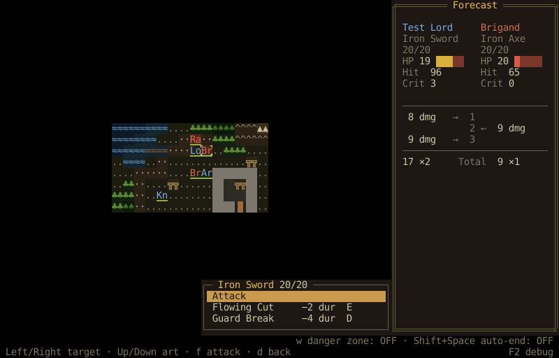
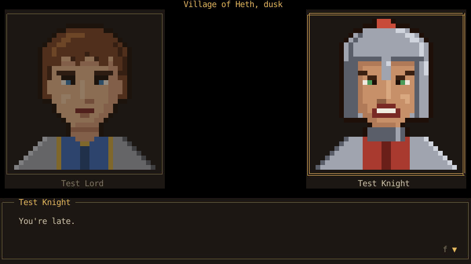
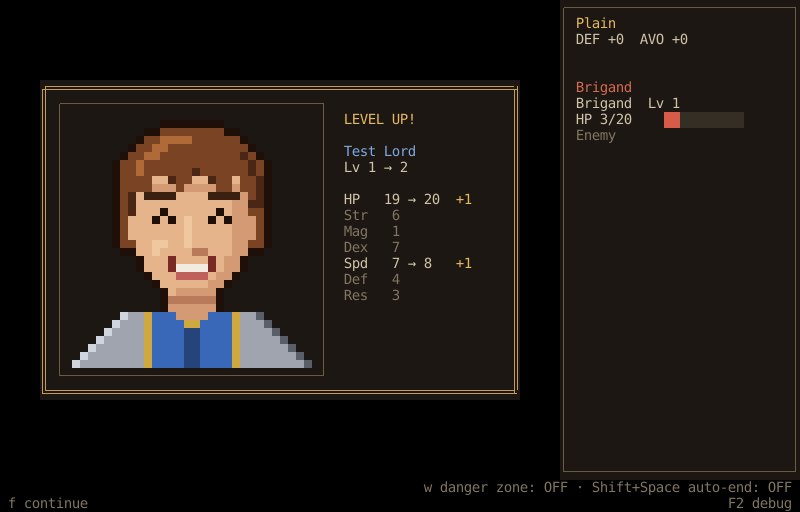
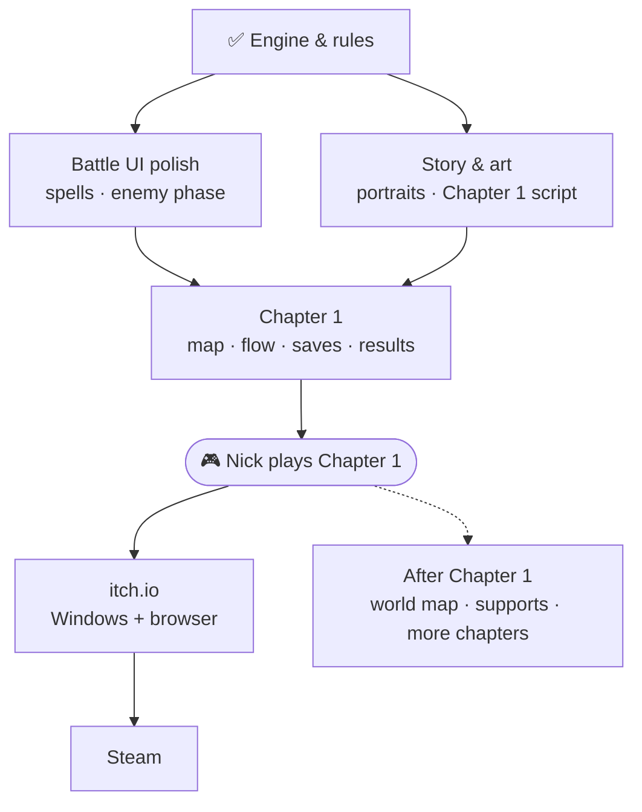
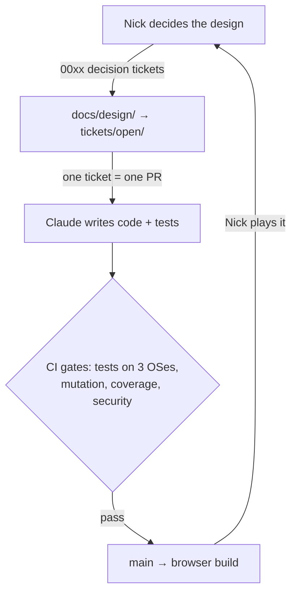

# Visions of Shuyi

**A keyboard-driven tactical RPG drawn in coloured glyphs.**
*Fire Emblem's battles, Dwarf Fortress's look, a text editor's hands.*

[**▶ Play the latest build in your browser**](https://zafnok.github.io/visions-of-shuyi/)
&nbsp;·&nbsp; [Roadmap](docs/ROADMAP.md)
&nbsp;·&nbsp; [Backlog](tickets/README.md)
&nbsp;·&nbsp; [Design decisions](docs/design/README.md)

## What it is

A turn-based tactics game in the spirit of Fire Emblem, where every tile, unit
and menu is a character on a grid, like Dwarf Fortress or Rogue. You play it
entirely from the keyboard: a virtual cursor, vim-style movement by default
(or a left-handed layout), one hand steering and one hand acting. Every key
will be rebindable.

- **Setting and tone:** a medieval fantasy war between European-style
  kingdoms, in a world with other continents that feel different. Dark, with
  warmth and humour in between (think *Path of Radiance* and *Triangle
  Strategy*). It ends in a hard-fought victory, not a tragedy.
- **Your lead:** a disgraced, exiled young noble, with a gender you choose
  and a class line of their own.
- **Battles:** weapon durability and Combat Arts, spells that set forests on
  fire or freeze rivers, class skills, and a limited number of turn rewinds
  per map. Classic mode (fallen units are gone) or Casual.
- **Between battles:** level ups, promotions and class changes, supports
  earned by fighting side by side, and dialogue scenes with two pixel-art
  portraits on screen.

<table>
<tr>
<td width="50%"></td>
<td width="50%"></td>
</tr>
<tr>
<td align="center">Dialogue scenes with two portraits</td>
<td align="center">Level ups</td>
</tr>
</table>

Screens are rendered from the game's own snapshot tests, with test units
and placeholder portraits (the final art is coming).

## Status

**Pre-alpha: a playable test battle, heading for a complete Chapter 1.**

The [browser build](https://zafnok.github.io/visions-of-shuyi/) is rebuilt from
`main` after every merge. Today it offers a **quick battle** where you can:

- move units with the cursor, see move and attack ranges and the enemy danger
  zone, and read terrain and unit info;
- attack with a full forecast (hit, crit, damage, doubling, counters) and
  watch the exchange play out;
- use Combat Arts, class skills, potions and gear, and swap weapons;
- rewind a turn when a move goes wrong;
- fight enemies that fight back;
- earn EXP and level up;
- trigger dialogue on the battlefield: boss lines, last words, and *Talk*;
- hear it: battle, menu and cursor sounds, plus title and battle music.

Not in yet: casting spells from a menu, the animated enemy phase, the real
Chapter 1 map, cast and script, saving, and the options menu.

### Progress by milestone

*As of 2026-09-30. The live source is [`tickets/`](tickets/README.md):
a ticket is done when its file is in `tickets/done/`.*

| Block | Milestone | Progress | Done |
| ----- | --------- | -------- | ---: |
| `00xx` | Design decisions | `████████████░░░░░░░░` | 19 / 32 |
| `01xx` | M0 Foundation: CI, gates, releases | `██████████████████░░` | 9 / 10 |
| `02xx` | M1 Engine: glyphs, font, input, audio | `████████████████░░░░` | 17 / 21 |
| `03xx` | M2 Core rules | `███████████████████░` | 14 / 15 |
| `04xx` | M3 Battle UI | `████████████████░░░░` | 22 / 28 |
| `05xx` | M4 Enemy AI | `███████░░░░░░░░░░░░░` | 1 / 3 |
| `06xx` | M5 Progression | `████████████░░░░░░░░` | 3 / 5 |
| `07xx` | M6 Story & dialogue | `█████████░░░░░░░░░░░` | 5 / 11 |
| `08xx` | M7 Chapter 1 & game flow | `█░░░░░░░░░░░░░░░░░░░` | 1 / 16 |
| `09xx` | M8 Release | `███░░░░░░░░░░░░░░░░░` | 1 / 6 |
| | **Total to release** | `█████████████░░░░░░░` | **92 / 147** |

Most of the remaining design questions are deliberately left for later
(music for places the game doesn't reach yet, and tuning after the first
playtest). The game rules and the story's bible, cast and outline are decided
and written down in [`docs/design/`](docs/design/README.md) and
[`docs/story/`](docs/story/README.md).

## Roadmap

**Next: a complete, story-driven Chapter 1.** One battle (rout the enemy),
six units including the lord, contextual tips, and a full opening scene.
What's on the way there, roughly in order:

1. **Last design calls:** bought portrait art, victory and defeat stings,
   Game Over music.
2. **Battle polish:** the spell menu with terrain effects, the animated enemy
   phase, boss AI with Combat Arts and skills.
3. **Story and art:** reply choices and the lead's pronouns, character names
   and rename support, Chapter 1 portraits and script, music in scenes.
4. **Game flow:** title → chapter → battle → results, saving and suspend, the
   Chapter 1 map and units, music, credits, the title screen and chapter card.
5. **Playtest:** Nick plays Chapter 1 start to finish; feedback becomes tickets.

**Then release:** itch.io first (Windows and browser), then Linux and macOS
builds and Steam. The full dependency graph is the *Chapter 1 critical path*
in [`docs/ROADMAP.md`](docs/ROADMAP.md).

**After Chapter 1:** a world map in the style of *The Sacred Stones* with fixed
and random skirmishes, support conversations and a camp, controller support
(for the Steam Deck), higher class tiers, colour themes and a colour-blind
palette, difficulty modes, and more chapters and continents.

## How it's built

One unusual thing about this project: **Nick designs the game, Claude (an AI)
writes the code**, and the tests are the code review.

- **Rust**, rendered with [macroquad](https://macroquad.rs/) as a grid of
  coloured glyphs, so the same code runs as a Windows exe and in the browser
  (WASM).
- **A pure, deterministic rules core** (`trpg-core`): no I/O, no clock, state
  changes only through commands that produce events. That makes turn
  rewind and exhaustive testing cheap.
- **Data-driven content:** classes, items, skills, arts, spells, terrain,
  palette and keymap live in [`assets/data/`](assets/data) as RON files.
- **Tests as review:** unit and property tests for the rules, snapshot tests
  for every screen (the screenshots above come from them), mutation testing
  on every PR, and ticket and hard-coded-key linters.

| Where | What |
| ----- | ---- |
| [`tickets/`](tickets/README.md) | The backlog. Each ticket is a Markdown file; finished ones move to `tickets/done/` |
| [`docs/ROADMAP.md`](docs/ROADMAP.md) | Milestones and the path to a playable Chapter 1 |
| [`docs/adr/`](docs/adr/README.md) | Technical decisions (Rust, the glyph renderer, testing, CI…) |
| [`docs/design/`](docs/design/README.md) | Game-design decisions, made by Nick |
| [`docs/story/`](docs/story/README.md) | Story beats, bible and characters (spoilers!) |
| [`crates/`](crates) | `core` rules · `content` data loading · `ui` screens · `app` the game binary · `xtask` repo tooling |
| [`CLAUDE.md`](CLAUDE.md) + [`.claude/skills/`](.claude/skills) | Instructions for the AI sessions that build the game |

## Play

The latest `main` build runs in your browser, no install:
**https://zafnok.github.io/visions-of-shuyi/**

Targets: a Windows executable first (itch.io, later Steam), then Linux and
macOS, plus the browser build.

## Releasing

Releases are cut by pushing a tag ([ADR-0009](docs/adr/0009-distribution.md)):

1. Bump `version` in the root `Cargo.toml`'s `[workspace.package]` and merge
   that change to `main`.
2. `git tag vX.Y.Z && git push origin vX.Y.Z` (the tag's version, without the
   leading `v`, must exactly match `Cargo.toml`, or the workflow fails).
3. The [release workflow](.github/workflows/release.yml) builds Windows,
   Linux, macOS (universal) and web packages — each with `LICENSE`,
   `THIRD_PARTY_LICENSES.html` and a `README.txt` — and attaches them to a new
   [GitHub Release](https://github.com/Zafnok/visions-of-shuyi/releases) for the
   tag with auto-generated notes.

To try the whole pipeline without cutting a real release, run it manually via
**Actions → Release → Run workflow** on any branch: this does a dry run
(builds and uploads the four packages as workflow artifacts, but creates no
release).

## License

**Source-available, not open source.** Copyright (c) 2026 Nick Wentz, all
rights reserved. You may read and learn from the code, use it in
non-commercial teaching, make free non-commercial mods, and stream or post
videos of the game (monetised is fine). You may not redistribute or sell it or
games made from it. See [`LICENSE`](LICENSE) for the exact terms, and
[`THIRD_PARTY_ASSETS.md`](THIRD_PARTY_ASSETS.md) for third-party material.
